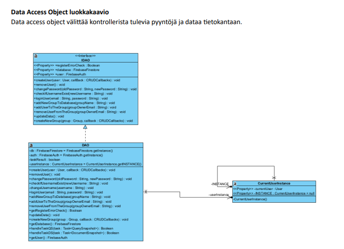
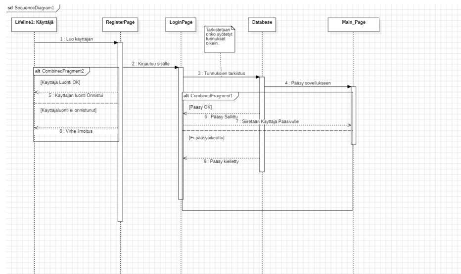
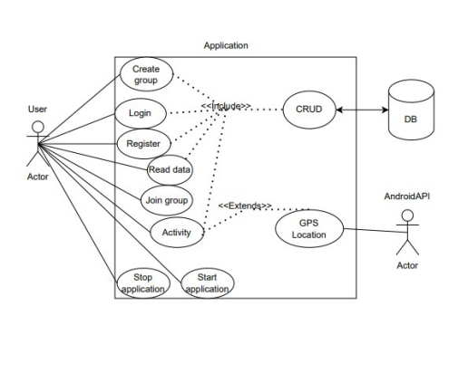

### Lenkkifrendi
---
### Käyttöönotto

- Kloona repositorio koneellesi, asenna myös Android Studio.
- Android studiossa Build > Build Bundle /APK > Build APK
- Saat .apk päätteisen tiedoston jonka voit viedä android puhelimellesi.
- Vaihtoehtoisesti voit myös ajaa sovellusta Android Studion emulaattorissa, Huomion arvoista on että GPS paikannus ei toimi emulaattorilla.
---
## Projektin  tavoite

Projektin  päämääränä on tuottaa  yksinkertainen ja helppokäyttöinen  liikuntaa  tukeva  Android-mobiilisovellus  matkapuhelimelle.  Sovelluksella  käyttäjä  voi  tallentaa ja  tarkkailla  omien  liikuntasuoritteiden  kestoa ja pituutta, sekä  perustaa  liikuntaryhmiä, johon  voidaan  kutsua  myös  ystävät ja harrastusporukat  mukaan.

Sovellus  kerää  tietoa  käyttäjän  liikkeistä  sekä  liikuntatottumuksista.  Alkuperäisenä  tarkoituksena  oli  hyödyntää  käyttäjältä  saatua  dataa  kaupallisesti, myymällä  sitä  urheiluvälinevalmistajille, mutta  kriittisen  tarkastelun  jälkeen  tulimme  kuitenkin  lopputulokseen, että  käyttäjädataa  ei  tulla  käyttämään  kaupallisessa  tarkoituksessa  vaan  käyttäjadataa  sovelletaan  sovelluksen  käyttökokemuksen  parantamiseen, ja tuotteiden  mainostamisen  sijaan  koneoppimisen  avulla  tarjoamme  käyttäjäprofiilin  perusteella  liikuntasuosituksia, kuten  juoksua  harrastavalle  esim. Helsinki marathon.

## Sovelluksen  määrittely

### Toiminnallisuudet

Projektin  aikana  luodaan  tarvittavat  toiminnallisuudet  joihin  kuuluvat:

-   Käyttöliittymä

-   Googlen  Location  Api-rajapinnan  implementointi

-   Tietokantayhdeydet

-   Sovelluslogiikan  luonti

-   Yksikkötestaus

-   Validointi

Myöhemmässä  vaiheessa  toteutettavat  toiminnallisuudet:

-   Koneoppiminen

### Käyttöliittymä
---
Sovellus  avautuu  kirjautumissivulle, jossa  käyttäjä  voi  syöttää  sähköpostin ja salasanan. Vaihtoehtoisesti  jos  käyttäjällä  ei  vielä ole tunnuksia  sovellukseen  löytyy  kirjautumissivulta “Register”-painike, joka vie rekisteröitymissivulle. Rekisteröitymissivulla  käyttäjä  täyttää  vaaditut  kentät ja rekisteröityy.

Kirjauduttuaan  sisään  käyttäjä  päätyy  oletusnäkymään, joka  vastaa  käyttäjän  profiilisivua. Alapaneelissa on navigointipalkki.

Navigointipalkissa on oletusnäkymän (profiilisivu) lisäksi  myös  aktiviteetti- ja ryhmäsivu. Aktiviteettisivulla on “Start activity” ja “Stop activity” painikkeet. Nimensä  mukaan “Start activity”-painike  aloittaa  käyttäjän  aktiviteetin  keston ja kuljetun  matkan  mittaamisen. “Stop activity”-painike  pysäyttää  aktiviteetin ja visualisoi  saadun  datan  käyttäjälle, sekä  tallentaa  tiedon  tietokantaan.

Ryhmäsivulla on mahdollisuus  liittyä  ryhmiin, joissa on muita  käyttäjiä. Kun käyttäjä on osallisena  ryhmään  pystyy  hän  tarkkailemaan  ryhmän  muiden  jäsenten  aktiviteetteja  näytölle  avautuvasta  listasta.
___
### Tekniset  määritelmät

Ohjelmointikielet

-   Java 17

Sovellusalusta

-   Android

Tietokanta

-   NoSql  Firebase

Android Api Level

-   34

Muut Apit

-   Google Location

Testaus

-   Junit 4

---
### Projektinhallinta ja kommunikointi

-   Trello

-   Discord

---
### Roadmap

On going (Koko projektin  ajan  tapahtuvat  asiat)

- Ohjelman  dokumentaatio ja kaavioiden  piirtäminen

### 1. Viikko

- Projektin  visiointi

### 2. Viikko

- Resurssien  kerääminen

- Tietokantayhteys

### 3. Viikko

- Käyttöliittymä

- Käyttäjätili

### 4. Viikko

-  GPS-anturi  yhteyden  luonti

-  Käyttäjäryhmien  lisääminen

### 5. Viikko

- Käyttäjädatan  kerääminen

- Käyttäjädatan  visualisointi

### 6. Viikko

- Junit testaus

### 7.Viikko

- Ensimmäinen  testiversio  sovelluksesta

- Sovelluksen  ulkoasun  parantelu

### 8. Viikko

- Sovelluksen  demotilaisuus
---
### Kustannusarvio

Noin 4 kuukautta  kestävän  projektimme  kustannus  arvio on 200.000 euroa. Pelkästään  ohjelmoijien  kuluihin  menee  noin 140.000 euroa.

---

### Keskeiset  riskit

Suurimpiin  riskeihin  projektissa  kuuluu  ehdottomasti  tiukka  aikataulu. Tiukkaa  aikataulua  noudattava  projekti  voi  helposti  myöhästyä  jonkin  teknisen  ongelman  tai  tiimin  vähäisen  tuntemuksen  ansiosta  jotain  tiettyä  teknologiaa  kohtaan.

Jos sovelluksesta  ei  saada  tarpeeksi  hyvää  kilpailijoihin  verrattaen  määräajassa, voi se jäädä  kilpailijoiden  jalkoihi.

---

### Kehittäjät

-   Niko Mäenpää

-   Tristan Ellenberg

-   Kaspar  Tullus

-   Samu Aikio

---

# Sovelluksen kuvantamiseen käytettyjä kaavioita

### Luokkakaavio

Luokkaaviolla kuvataan ohjelman koostuminen luokista.

---

### Sekvenssikaavio
Sekvenssikaavio mallintaa sovelluksen sisäistä toimintaa käyttötapauksittain.

1. Käyttäjä luo käyttäjätunnuksen. Jos käyttäjätunnuksen luonnissa tapahtuu virhe, niin
   palataan rekisteröitymissivulle, muuten jatketaan kirjautumisikkunaan.
2. Jos käyttäjätunnuksen luonti onnistui, yritetään kirjautua sovellukseen.
3. Jos kirjautumistiedot ovat oikein, siirrytään kotinäkymään, muussa tapauksessa palataan
   kirjautumisikkunaan.

---
### Aktiviteettikaavio

Aktiviteettikaavio mallintaa järjestelmän dynaamista käyttäytymista, eli tarkka suorituspolku selviää mahdollisesti vasta suorituksen aikana.

---

### Käyttötapauskaavio

Käyttötapauskaavio mallintaa sovelluksen vuorovaikutusta ympäristön kanssa.

Vuorovaikutuksia ovat mm. syötteet ja tulosteet mitä ohjelmaa saa ja tarjoaa.

---

### Sijoittelukaavio

Sijoittelukaavio kuvantaa laitteistoa jolla järjestelmän on tarkoitus toimia. Kaavio osoittaa riippuvuudet ja tiedonsiirto tarpeet eri laitteiden välillä.

---
### Lopuksi

Projektin tarkoituksena oli oppia projektin hallintaa, jokainen sai vuorollansa olla scrum master, eli nk. projektin johtaja.
Vaikka yhdelläkään sprintillä ei saatu aivan kaikkia tehtäviä tehdyksi, mitkä oli sovittu, mutta ne valmistuivat myöhemmissä sprinteissä. Ryhmässä vallitsi konsensus siitä, että tuote valmistui määräajassa vastaamaan odotuksia.
Projektin tärkeimmät opit olivat varmasti:

- Kommunikoinnin tärkeys.
- Vaatimusten ja työtaakan asettaminen järkeväksi käytettävissä oleviin resursseihin katsoen.
- Työn jakaminen.
- Oikeiden teknologioiden valitseminen.
- Työtehtävien pilkkominen pieniksi kokonaisuuksiksi.

Lenkkifrendi tarjoaa perusominaisuudet joita Product owner meiltä toivoi, tuote ei toki ole valmis, mutta tästä on hyvä lähteä jatkokehittämään.
